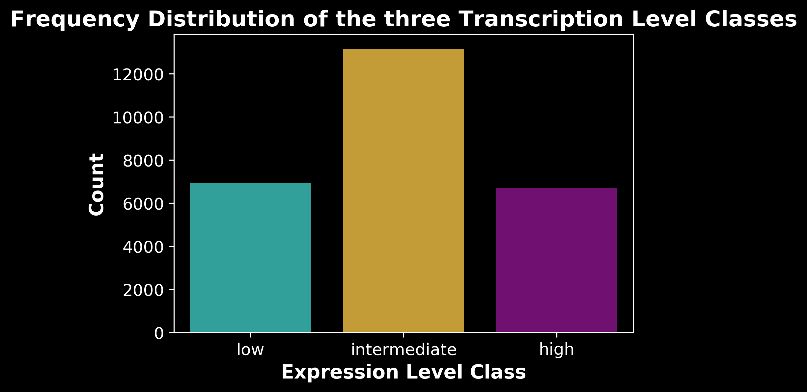

### Framing the problem: 

* The unequal utilization of synonymous codons (CUB) affects numerous cellular processes i.e. translation rates, protein folding and mRNA degradation [[Ref](https://pubmed.ncbi.nlm.nih.gov/29386398/)].

* The use of synonymous codons in the gene coding regions are not random, and CUB is an essential feature of most genomes, which has been reported to have an strong impact on the transcription levels of genes [[Ref](https://pubmed.ncbi.nlm.nih.gov/27671647/)] 🔬📚🔠.

* Since codons within a synonymous codon group are translated at different rates, many computational translation models rely on analyzing synonymous codons. One strategy to predict transcription rates, is to focus on CUB observed only in highly expressed genes, which should be under selective pressure to be translated efficiently (and whose CUB may therefore be more indicative of transcription rates) [[Ref](https://www.biorxiv.org/content/10.1101/2020.03.26.010488v1.full)]. 

* Previous analysis have demonstrated that in some cases, codon usage in genes that were expressed in a broad range of tissues was influenced primarily by the tissue in which the gene was expressed maximally [[Ref](https://www.ncbi.nlm.nih.gov/pmc/articles/PMC3454886/)].

* It is therefore crucial to be able to accurately measure CUB for a given sequence to optimize coding sequences for different applications.

 

### Schema: 

Two main approaches were taken to better undestand the role of CUB on the transcription level:

* **Data Analyses, feature selection and and Machine Learnig**: 

> What features can explain better the observed differences in the transcription level?. 

> Here we hypothesize that the CUB plays an important role in transcription levels.

1) Characterization of codon usage -> calculate the CUB metrics.

2) Exploratory Data Analyses and Feature selection.

3) A traditional machine learning approach.
    
* **Deep Learning Approach:**

> In this section I used a CNN to predict Max TPM from one_hot_encoded sequeces in order to study which sequence has more predictive power.

> The hyphothesis is that the codon sequence largely determines the transcription level of a gene.

1) Train a CNN to predict transcription levels from codon one_hot encoded sequences (nucleotides, codons and aminoacids).

2) Compare model performance
    
* **Conclussions**:

* **Future Directions**:

-----

## 1. Get and process data

* 1.1 Data sources:

	- for RnaSeq data: https://www.ebi.ac.uk/gxa/experiments-content/E-CURD-1/resources/ExperimentDownloadSupplier.RnaSeqBaseline/tpms.tsv
	- for CDS sequences: https://www.arabidopsis.org/download_files/Sequences/Araport11_blastsets/Araport11_genes.201606.cds.fasta.gz

* 1.2 Preprocess the data:

	- In the RnaSeq data we calculate for each gene the maximal TPM (Transcripts Per Kilobase Million) value across samples (tissues and developmental stages).
	> `Max TPM` is the highest expression level detected for a given gene over all stages or tissues examined. 
	- In the CDS (coding DNA sequence data), when there are multiple transcripts per gene, we only keep the longest CDS sequence per gene.
	
## 2. Definitions/Codon Usage Metrics.

* **RSCU: Relative synonymous codon usage** for each codon within a gene.

	- RSCU value < 1.0: negative codon usage bias.
	- RSCU value = 1.0: no bias;
	- RSCU value > 1.0: observed number more than expected (positive CUB).

* **CAI: Codon adaptation index** for a CDS is the geometric mean of the RSCU values corresponding to each of the codons used in that CDS, divided by the maximum possible CAI for a CDS of the same amino acid composition

* **GC-Content (GC%)** of synonymous codons has been reported to strongly influence amino acid (aa) usage. In particular the GC-Content of aa in the first, second and third position. Hence, these parameters offer important information to estimate CUB.

* **Nc**: This metric quantifies how far the codon usage of a gene deviates from equal usage of synonymous codons. It is one of the most used metric to estimate CUB.

    - Nc ranges from 20 and 61. 20 represents **extreme bias** where one codon is exclusively used for each aa, whereas 61 reflects an equal use of alternative synonymous codons across the gene (**no bias**).
	
## 3. Data analyses

### 3.1: Characterization of codon usage: create a DataFrame containing some of the most relevant CUB metrics decribed in the literature.

### 3.2: Exploratory Data Analyses.

* **Frequency Distribution** of the three transcription level classes:

 

* **Log transform** the target variable:

* **Mann-whitney statistical tests** between high and low transcription classes for all the variables to check their statistical significance:

* **Principal Component Analysis (PCA)** of RSCUs in highly-expressed transcripts vs low-expressed genes. 

	> Here I used the statistical method of PCA, which has been previously used classify and categorize variations in codon usage [[Ref]](https://www.biorxiv.org/content/10.1101/528083v1.full). 

* **Heat-map of RSCU values of high, intermediate and low expression groups: L👀king for patterns**.

  

* To further inspect the patterns in the RSCU values I will also create scatter polar plot to inspect differences among the three transcription levels:

* **Box-Plots to investigate differences in gene expression among plant tissues**:

* **Pair-Wise Relactionships**:

* **Correlation Plots**:

	
## 4. Exploring the predictive value and feature importance of the CUB metrics: A traditional ML approach.

* **4.1 Model Performance on train set**:

* **4.2 Model Performance on test set**:

* **4.3 Feature Importance**:

## 5. A deep learning approach.

* **5.1: Design a CNN architecture to predict transcription levels from one_hot_encoded(padded) sequences**:

 

* **5.2: Training a CNN using the One_Hot_Encoded Sequences:**

 

## 6. Conclussions.

* Based on the analyses performed in the present study, there are many codons that contribute the observed differences in the expression level, but out of the 61 codons, the ones that appeared to have a larger impact are:

   * CAG (Gln), GTC (Ala) -> Usage Positively correlated with expression
   * ATA (Ile), TTC (Phe) -> Usage Negatively correlated with expression

* Furthermore, analyses of the **codon usage frequency** revealed the importance of codons encoding alanine (GCT, GCC) and cysteine (TGT, TGC), and the percentage of alanine correlated positively with the expression level, whereas the percentage of cysteine correlated negatively.

* The **GC% content** was the feature with the strongest correlation, suggesting the importance of the GC content to explain the differences in gene transcription. This can be explained by mutation events such deamination that take place during the transcription process, which in turn may lead to a higher GC content in highly expressed genes [[Ref](https://www.nature.com/articles/ng1103z)].

* The **tissue** appears to be another important factor to explain the differences in expression level among genes. Furthemore, systematic differences in the usage of synonymous codons among *Arabidopsis thaliana* genes have been reported to be expressed specifically in distinct tissues [[Ref](https://pubmed.ncbi.nlm.nih.gov/22865738/)].

* The best performing CNN model was trained on the one_hot encoded codon sequence, which again reflects the importance of **codon usage patterns** in predicting the transcription level.

* Although we observed important associations between CUB and transcription levels, the predictions obtained from the machine learning models distant considerably from the test values. This indicates that there may be other important features determining the transcription level of genes such as the promoter or ribosome binding sites controlling the expression of the gene.

## 7. Future Directions.

* To better understand the effects of CUB on the transcription level we could **include other parameters** not used in this analysis such as:

	* Codon Robustness Index (CRI).
	* Frequency of Optimal Codons (Fop).
	* Synonymous Codon Usage Order (SCUO).
	* Information-Based Codon Usage Bias (iCUB).
	* Codon Deviation Coefficient (CDC).

* Furthermore, we could import meta-data with information from the encoded protein such:

	* The function (Proteins with sorter life span will be synthesized at higher rates).
	* Size.
	* Hydrophobia.
	* Molecular weight.
	* Aromaticity

* Another interesting aspect to look at is the **effect of the relative intragenic position on the CUB**. For this we could split the CDS sequences into bins (e.g 10 bins) to study differences in CUB in different positions of the CDS sequence.
